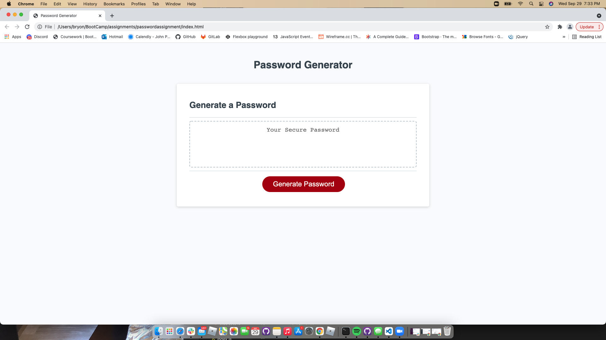
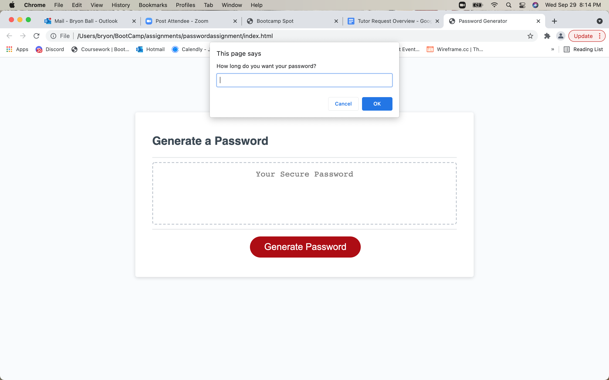
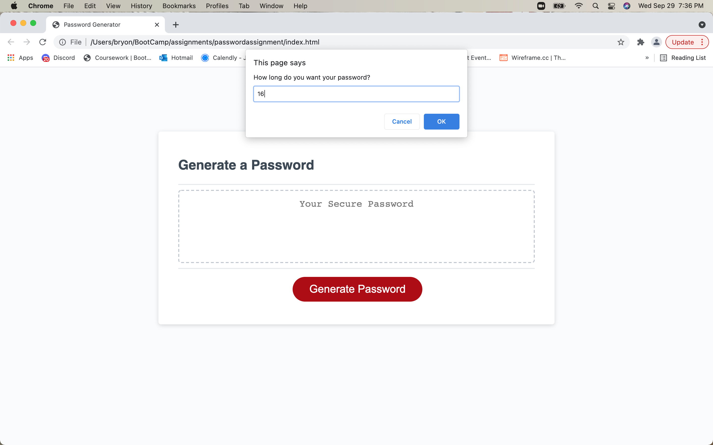
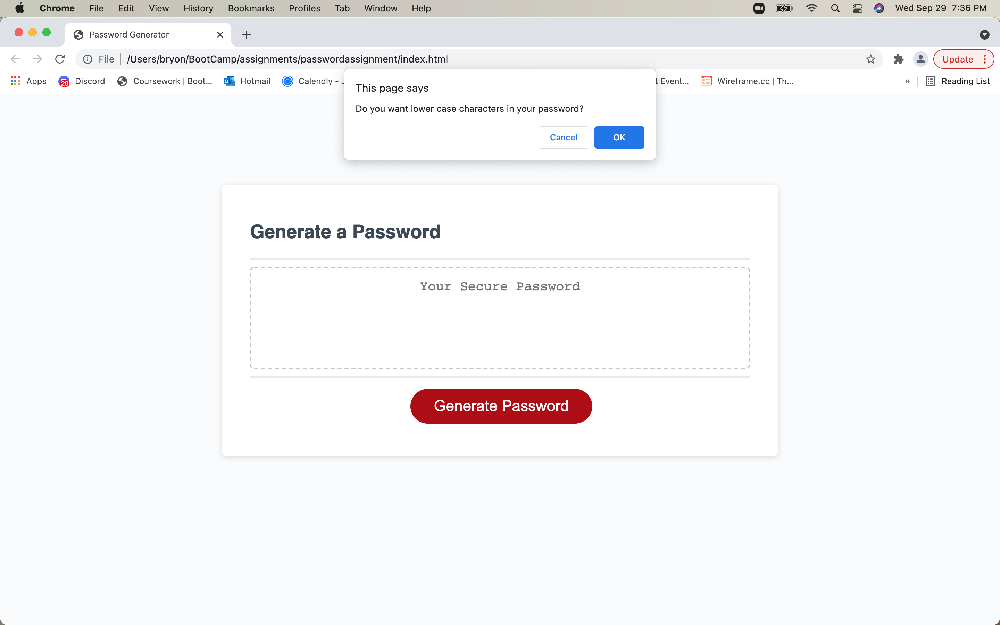
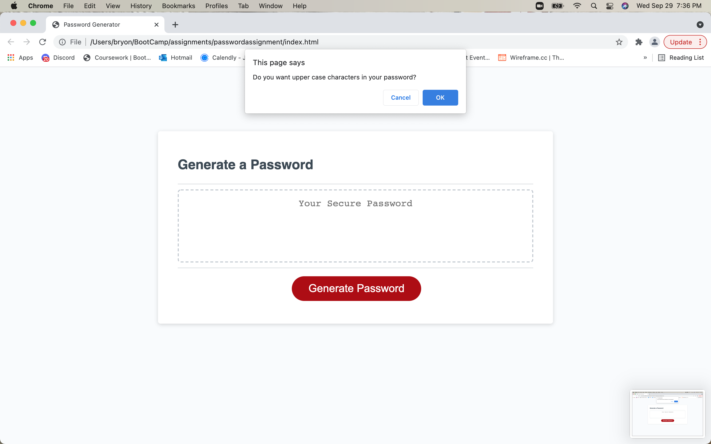
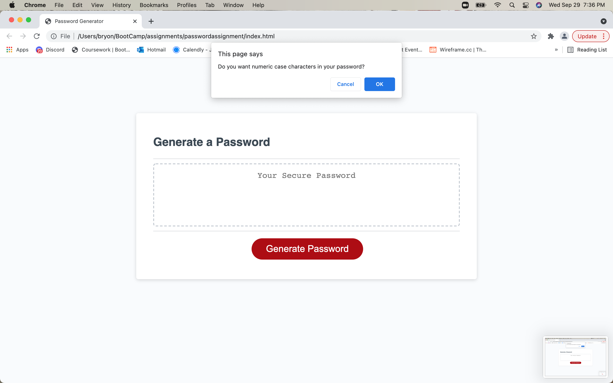
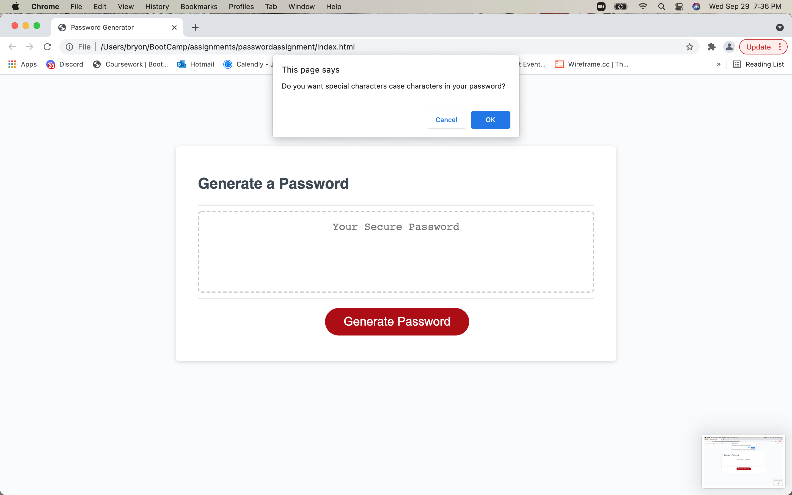
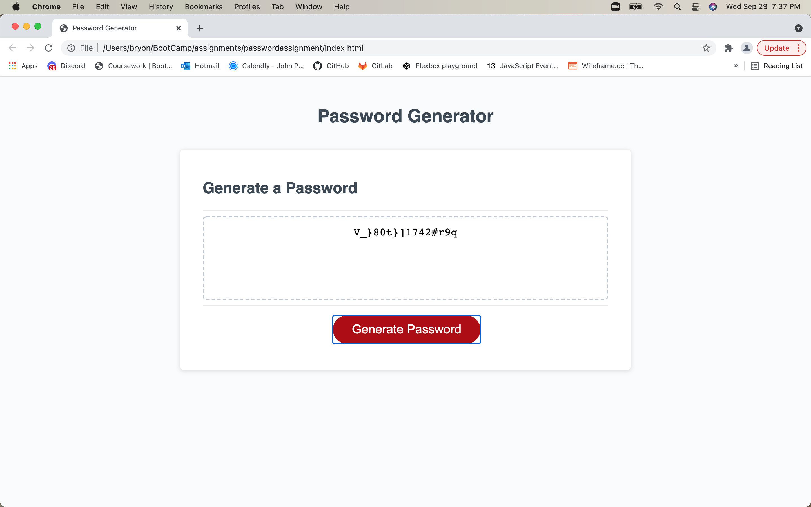

Password Generator Assignment

My Task was to modify start code to create an app that generates random passwords based on criteria selected.This app will run in the browser and feature HTML, CSS and JavaScript code.

# Mock-Up

# WHEN given the task of creating a new password the user can click the button to create a new password.

# THEN, the user does in fact gets prompted to enter the length of the password.

# THEN, the user chooses a length between 8 and 128 characters.

# WHEN, asked for character types to include in the password; lowercase,uppercase,numeric,and/or special characters the following prompts appear:

# THEN, my password is generated in the box below "Generate a Password".

# This is a link to my deployed/GitHub pages application.

# https://bryonbsmb1.github.io/bballpasswordassignment/
